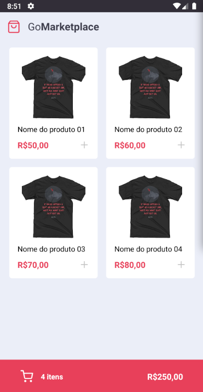
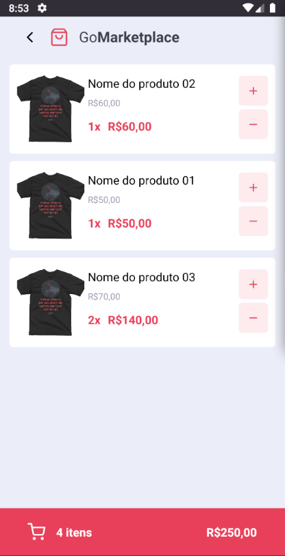

# GoMarketplace's Mobile Application

React Native project proposal as a challenge by the instructor during the Rocketseat GoStack course to memorize the content.
This is the GoMarketplace's Mobile Application to manage a store.

## What I learned in this project?

 - I learned how change a property of an object, that is storage in an array, using map function.

## See the screenshots

